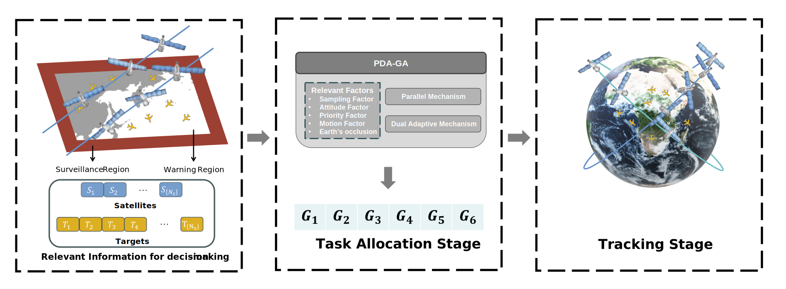

### Parallel dual adaptive genetic algorithm: A method for satellite constellation task assignment in time-sensitive target tracking
<p align="center">

</p>

### PDA-GA
[Parallel dual adaptive genetic algorithm: A method for satellite constellation task assignment in time-sensitive target tracking
](https://doi.org/10.1016/j.asr.2024.07.044)

> Abstract: The evolution of satellite surveillance technology, bolstered by advanced onboard intelligent systems and enhanced attitude maneuver capabilities, has thrust mission scheduling and execution into the spotlight as a prominent and dynamic research field in recent years. 
As the demand intensifies for mission scheduling and execution to transition from static ground targets to time-sensitive moving targets, conventional scheduling methods often fall short of delivering satisfactory results for continuously tracking these dynamic targets with constellation.
The paper introduces a rapid yet efficacious satellite constellation task assignment method, termed the Parallel Dual Adaptive Genetic Algorithm (PDA-GA), for the task assignment of multiple moving target tracking. 
Specifically, the dual adaptive mechanism isolates the genetic algorithm's sensitivity to parameters, while the parallel mechanism increases the evolutionary process's computation speed by deploying complex computations to the GPU.
Based on the meticulous analysis of the relevant factors that need to be considered in real tracking scenarios, the proposed PDA-GA can improve the search quality and efficiency of the task assignment solution. 
We conduct an extensive array of contrast and ablation experiments to showcase the performance and efficiency of PDA-GA in conjunction with autonomous attitude control algorithms across four simulated tracking scenarios. 
Furthermore, to enable high-fidelity simulation of tracking scenarios, we introduce the Constellation Target Tracking Environment (CTTE), which is equipped with a physics engine and algorithms for multi-satellite task assignment and single-satellite attitude control.
This endeavor lays a foundation for future research endeavors focused on autonomous tracking of multiple time-sensitive moving targets within large-scale constellation.

### Cite the paper
BibTex
```
@ARTICLE{10616229,
  author={Lu, Wenlong and Gao, Weihua and Liu, Bingyan and Niu, Wenlong and Wang, Di and Li, Yun and Peng, Xiaodong and Yang, Zhen},
  journal={IEEE Transactions on Aerospace and Electronic Systems}, 
  title={Reinforcement Learning Driven Time-Sensitive Moving Target Tracking of Intelligent Agile Satellite}, 
  year={2024},
  volume={},
  number={},
  pages={1-18},
  keywords={Satellites;Target tracking;Attitude control;Task analysis;Trajectory;Process control;Job shop scheduling;Attitude control;Satellite applications;Decision-making;Intelligent systems},
  doi={10.1109/TAES.2024.3436061}}

@article{lu2024parallel,
  title={Parallel Dual Adaptive Genetic Algorithm: A Method for Satellite Constellation Task Assignment in Time-Sensitive Target Tracking},
  author={Lu, Wenlong and Gao, Weihua and Liu, Bingyan and Niu, Wenlong and Peng, Xiaodong and Yang, Zhen and Song, Yanjie},
  journal={Advances in Space Research},
  year={2024},
  publisher={Elsevier}
}
```

